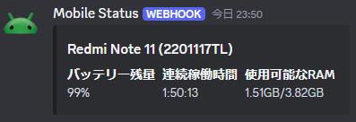

# Statushook
DiscordのWebhookに色々送ってDiscordから確認しようという試みです
## MacroDroid

1. [Macroファイル](https://raw.githubusercontent.com/manaken0522/statushook/main/macrodroid/main.macro)をダウンロードします
2. MacroDroidを開き、ホーム画面の "エクスポート/インポート"に進み、"インポート"項目内の"ストレージ"から先ほどダウンロードしたMacroファイルを選択します
3. マクロの編集画面が開いたら画面下部にある"ローカル変数"の"webhook_url"にWebhook送信先のURLを設定し、最後にマクロを保存します