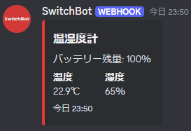

# Statushook
DiscordのWebhookに色々送ってDiscordから確認しようという試みです
## MacroDroid

### 必要なもの
- Webhook送信先のURL(webhook_url)
### Setup
1. [Macroファイル](https://raw.githubusercontent.com/manaken0522/statushook/main/macrodroid/main.macro)をダウンロードします
2. MacroDroidを開き、ホーム画面の "エクスポート/インポート"に進み、"インポート"項目内の"ストレージ"から先ほどダウンロードしたMacroファイルを選択します
3. マクロの編集画面が開いたら画面下部にある"ローカル変数"の"webhook_url"にWebhook送信先のURLを設定し、最後にマクロを保存します
## SwitchBot

### 必要なもの
- SwitchBotのToken(token)
- SwitchBotのClient Secret(client_secret)
- 温湿度計のデバイスID(meter_id)
- Webhook送信先のURL(webhook_url)
### Setup
GAS上で動作します  
1. ```git clone https://github.com/manaken0522/statushook```
2. ```cd statushook\switchbot```
3. ```clasp clone [ScriptID]```
4. ```clasp push```
5. プロジェクトの設定からtoken, client_secret, meter_id, webhook_urlを設定します
> [!NOTE]
> 定期実行したい場合はトリガーで設定してください